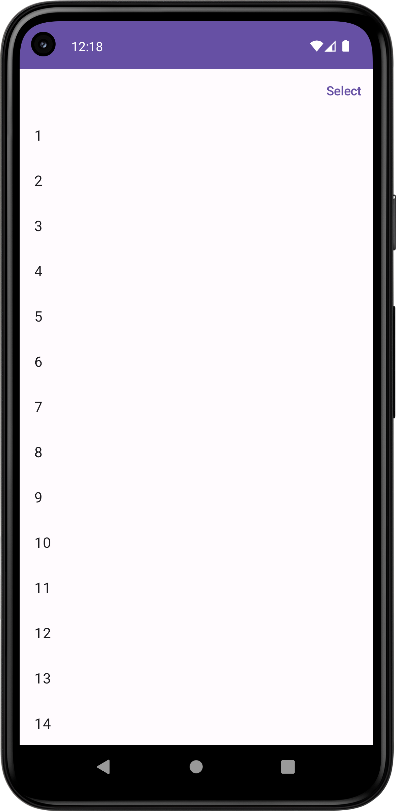
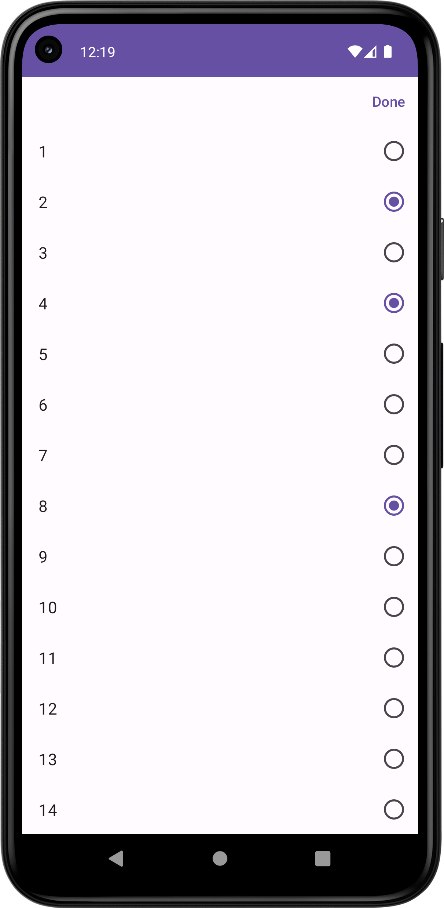

# MultipleSelectionList

>  A multiple selectionList component use for something like projects selected

I saw this from Youtube and collect it. It seems a truely valuable components.

CURRENT:

## Unselected

## Selected

TODO:

1. make a Selected All Button at Top Start Corner.

2. use Icon to beautify the selected Item.

